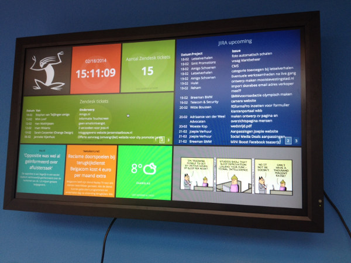

# Tim_online dashboard

[Tim_online](http://www.tim-online.nl) dashboard as used in the office. The
dashboard is based on the excellent [Dashing dashboard](http://shopify.github.io/dashing/).



## Setup

First install the required dependencies through `bundle install`.

The project is configured through environment variables. Ruby's dotenv gem is
used to manage the environment variables. Copy the .env.sample configuration
file to .env.

## Usage

Finally, start the dashboard server:

``` bash
dashing start
```

Now you can browse the dashboard at `http://localhost:3030/default`.

## Heroku Deployment

Read the [dashing documentation](https://github.com/Shopify/dashing) for a
description on how to deploy on Heroku.
